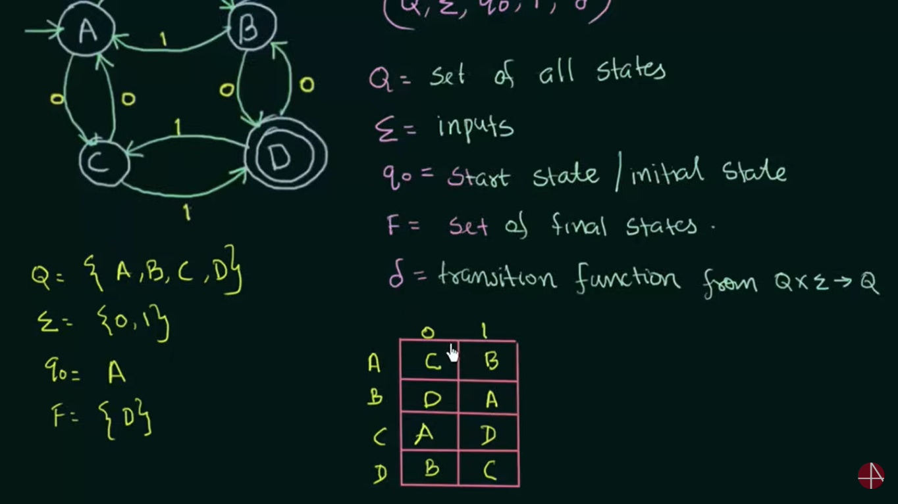
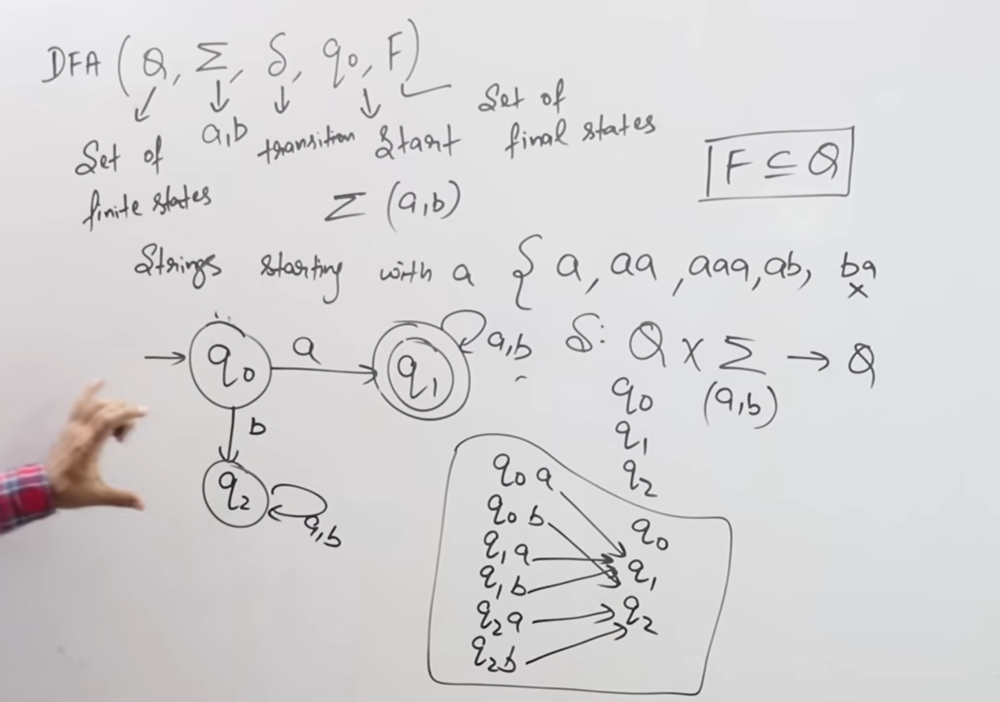
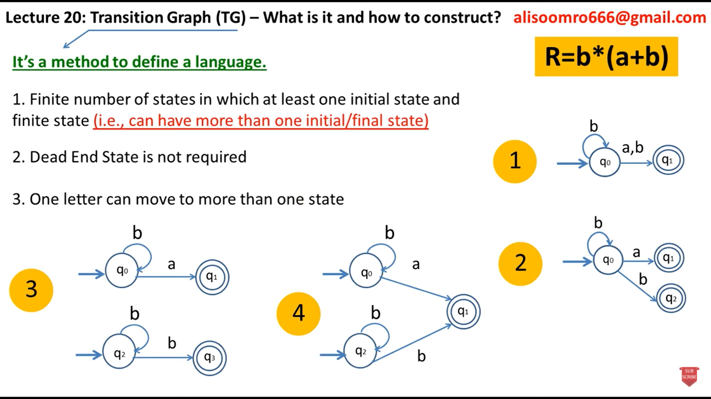
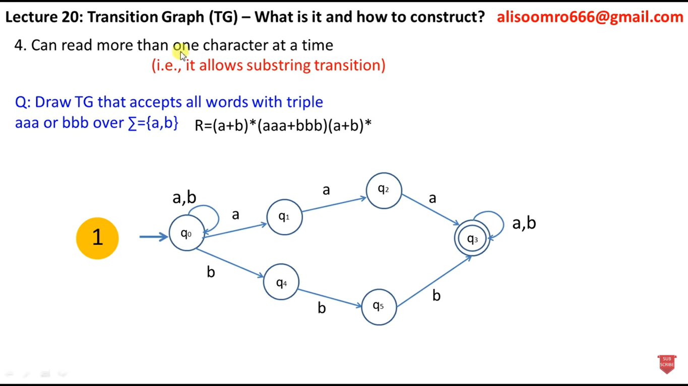
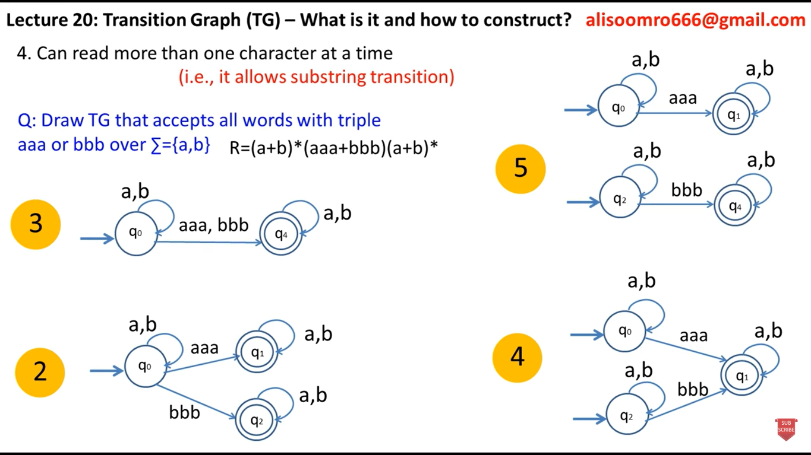
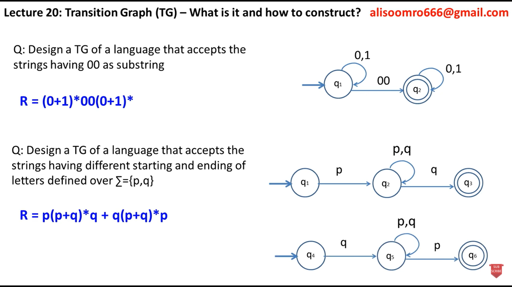
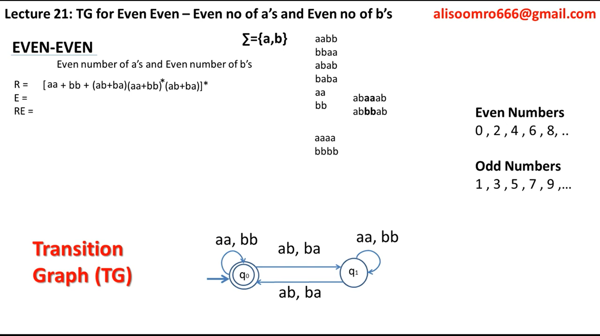

RE --> NFA 
RE --> DFA

NFA <--> DFA + Theory

Kleen Closure + Kleen Theorem

PDA with Examples + Turing Machine
Pumping Leema
Context Free Grammar + Parsing Tree(Marvi)
Context Free Language

RE, NFA, PDA, DFA, TG/transition graph --> FA, pdf, non regular theorem, kleen theorem not kleene star theorem, pumping leema, Turing Machine, CFG, Parsing

Prob:
1. RE --> DFA, DFA --> RE
2. RE --> NFA, NFA --> DFA, DFA--> NFA
3. Context Free Grammar: Lang Creation, Lang Tree
4. Pumping Leema
5. TG --> FA
6. PDA
7. Turing Machine

************
Finite State Machine

1. FA with output
	- Moore Machine
	- Mealy Machine

2. FA without output
	- DFA
	- NFA
	- e-NFA (epsilon NFA)
RE --> NFA 
RE --> DFA

NFA <--> DFA + Theory

Kleen Closure + Kleen Theorem

PDA with Examples + Turing Machine
Pumping Leema
Context Free Grammar + Parsing Tree(Marvi)
Context Free Language

RE, NFA, PDA, DFA, TG/transition graph --> FA, pdf, non regular theorem, kleen theorem not kleene star theorem, pumping leema, Turing Machine, CFG, Parsing

Prob:
1. RE --> DFA, DFA --> RE
2. RE --> NFA, NFA --> DFA, DFA--> NFA
3. Context Free Grammar: Lang Creation, Lang Tree
4. Pumping Leema
5. TG --> FA
6. PDA
7. Turing Machine

************
Finite State Machine

1. FA with output
	- Moore Machine
	- Mealy Machine

2. FA without output
	- DFA
	- NFA
	- e-NFA (epsilon NFA)

### Deterministic Finite Automata
- Given the current state we know what the next state will be
- It has only one unique next state
- It has no choices or randomness
- It is simple and easy

### Non Deterministic Finite Automata
- Given the current state there could be multiple next states
- The next state may be chosen at random
- All the next states may be chosen in parallel

### Exercises
1. FA that accepts exactly one a
2. FA that accepts all words starting with a
3. FA that accepts exactly a or b
4. FA for the language that has b as second letter over {a,b}
5. FA for the language that has exactly 4 ones in every string over {0,1}
6. FA for the language that only accepts {01,011,100} over {0,1}
7. FA for language L = {W.na= 1 w E (a,b)*}
8. L = {w E {0,1}* | w contains 00 as a substring}
9. FA that accepts all strings with double aa in somewhere
10. FA that contains exactly baa
11. FA that accepts exactly baa and ab
12. FA starting with a and contains any number of b's in end
13. FA that accepts all words ending with a 
14. FA that accepts all words starting and ending with a
15. FA that starts with xy over {x,y}
16. FA that accepts all strings with even length: {aa + bb + ab + ba} ✨
17. FA that accepts even number of b's  ✨ 
18. FA that accepts all strings with odd no of 1's

## DFA vs NDFA

| DFA | NDFA|
|-----|-----|
|Dead state| No dead state|
|No multiple choices/transition| Multiple choices/transitions|
|Null move not allowed|Null move allowed|
|Designing and understanding is difficult|Designing and understanding is easy|

## Transition Graph

Applications: 
FA: Digital Circuits, Text and Data Search
DFA: Patterns Matching, Compilers
PDA: Syntax checking, compilers, nlp
Turing Machine: Computational Theory, Algorithm Design, AI

Pumping Leema:
Method for proving infinite regular languages | Also Called Negative Test
If a lang passes PL, still it is undecideable whether it is regular or not, but
If a lang fails PL, then it is a non-regular lang

Closure Properties of Regular Languages:
	Union, Concatenation, Closure, Complementation, Intersection, Difference, Reversal, Homomorphism, etc
	But not under infinite union

Closure Properties of CFLs
	Closed under: union, concatenation, star, 
	But not under: intersection or complement

Kleene Theorem:
	A language is regular if and only if it can be described by a regular expression.
		- Every regular language can be represented by a regular expression.
		- Every regular expression describes a regular language

		A Language that can be defined by FA can be defined by a TG
		A Language that can be defined by TG can be defined by a RE
		A Language that can be defined by a RE can also be defined by FA

		Every Fa is itself already a TG.
		Every TG is not FA.
		FA(single letters)
		TG(multiple letters)

Types of PDA: Input tape is readable only
	- DPDA: at most one transition | final state for acceptance
	- NPDA: multiple possible transitions | final state + empty stack for acceptance
	- Multi Stack PDA: ecognize languages beyond context-free languages. In fact, a two-stack PDA is equivalent to a Turing 					machine(i.e., it can recognize any recursively enumerable language).
	- Multi Tape PDA: A multi-tape PDA has multiple stacks, each with its own set of operations. This can provide more computational 				power than a single-stack PDA.

Transition Graph
	A transition graph is a labeled directed graph where nodes represent states and edges represent transitions based on input symbols. 

LBA: Linear Bounded Automata for Context Sensitive Language
	- No sub types

Turing Machine + Types: input tape is readable and writeable
	Helps understand what can and can’t be computed (decidability).
	- Determinstic Behavior: Single choice
	- Non Deterministic behavior: Multiple choices/ left, right movement
	
	Recursive Enumerable Language: accepted by TM
	Recursive Lang: Accepted by Halting/Total TM

1. How do we denote the DFA: using 5 symbols

Finite State Machine

1. FA with output
	- Moore Machine
	- Mealy Machine

2. FA without output
	- DFA
	- NFA
	- e-NFA (epsilon NFA)

